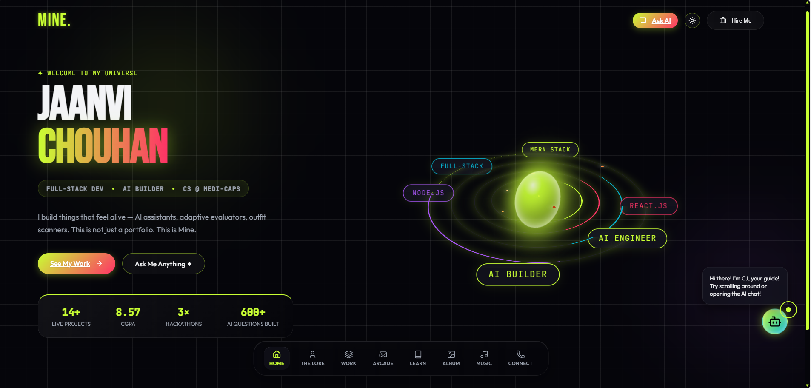

# 🌌 MINE. / NOVA - Dual-Mode Interactive Portfolio

👉 **Live Demo:** [https://nova-six-chi.vercel.app/](https://nova-six-chi.vercel.app/)

Welcome to my personal portfolio repository! This is a highly interactive, dual-mode engineering portfolio built from scratch. It is designed to express both my creative, tech-heavy personality and my clean, professional capabilities.

  
    
  
    
  

## ✨ Dual-Mode Architecture

The most unique feature of this project is the **Toggle Switch** architecture:

1. **The Universe Mode (Default)**
   - A sci-fi, high-tech, slightly edgy aesthetic featuring neon glows, glassmorphism, and 3D animations.
   - Showcases personality, passion, and "Main Character Energy".
   - Features a spinning 3D energy core, floating orbital skill badges, and an interactive AI robot that tracks your cursor.

2. **Hire Me Mode (Professional)**
   - With a single click, the site strips away the flashy colors and transforms into a clean, corporate, ultra-professional layout.
   - Tailored specifically for recruiters and hiring managers.
   - Prioritizes quick access to my CGPA, live projects, professional achievements, and downloadable CV.

## 🛠 Tech Stack

- **Frontend Framework:** React.js / Vite
- **Backend Framework:** Node.js / Express
- **Styling:** Vanilla CSS (Advanced 3D transforms, custom keyframe animations, glassmorphism)
- **Icons:** Lucide React
- **AI Integration:** Groq API (Integrated "Ask AI" assistant)
- **Forms:** Formspree

## 🚀 Key Features

- **The Lore (About):** A timeline of my journey from basic HTML/CSS clones to full MERN stack and AI engineering, complete with a mouse-tracking robot companion.
- **Featured Work & Learning Labs:** High-impact projects (AI tools and web apps) alongside a "Learning Labs" section demonstrating raw syntax practice.
- **Soundtrack Engine:** A built-in music player featuring a custom playlist (5 hand-picked tracks) with spinning record animations and seamless playback controls.
- **Dynamic Photo Album:** A Pinterest-style masonry grid showing off hackathons and memories with built-in zoom lightboxes.
- **Digital Badges:** A massive credibility section categorizing 39+ verified badges from Google Cloud, Cisco, and open-source programs using an interactive accordion UI.
- **The Arcade:** A hub of 10 fully playable, classic mini-games (Tic-Tac-Toe, Snake, Connect 4, etc.) built directly into the site to demonstrate complex React state-management and logic skills.
- **Ask AI:** An integrated AI assistant page backed by a Node.js server that lets visitors "chat" with a virtual version of me.

## 📁 Repository Structure

- `/frontend/src/pages/` - Contains all the major routed views (`Home`, `Arcade`, `About`, `Projects`, `Music`, `Album`, etc.)
- `/frontend/src/components/` - Reusable UI components, AI Robots, and the logic for the playable Arcade games.
- `/frontend/public/` - Static assets, downloaded certificates, music `.mp3` files, album `.jpeg` files, and badge images.
- `/backend/` - Node.js Express server handling the Groq AI API proxy for the chatbot.

## 💡 About Me

I am a driven CS undergraduate at Medi-Caps University specializing in Full-Stack web development and AI integration. My objective is to leverage my MERN stack expertise and problem-solving skills to build impactful, scalable products.

---
*Built with ❤️ and a lot of caffeine.*
